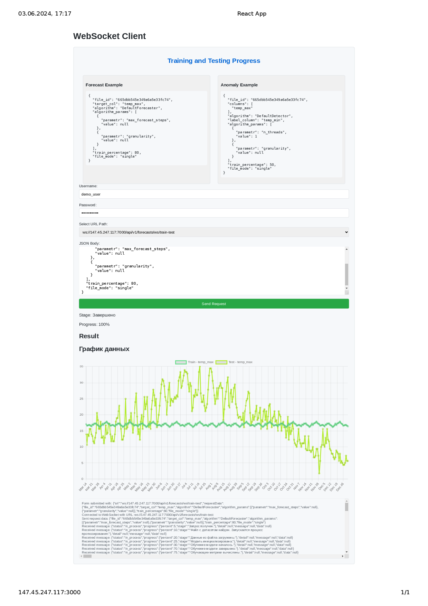

# WebSocket Client Demo(для создания использовал ChatGPT)

Этот проект является демонстрационным фронтендом для тестирования работы WebSocket сервера. Проект позволяет отправлять запросы через WebSocket и получать ответы в режиме реального времени. Пользователь может выбирать между двумя URL для подключения и отправлять данные в формате JSON.

## Описание

Проект предоставляет интерфейс для:
- Аутентификации пользователя.
- Подключения к WebSocket серверу.
- Отправки JSON данных на сервер.
- Получения и отображения ответа сервера.
- Логирования сообщений WebSocket.



## Структура проекта

- `src/App.js`: Основной компонент приложения.
- `src/WebSocketComponent.js`: Компонент для работы с WebSocket.
- `src/RequestBodyForm.js`: Форма для ввода данных и выбора URL.
- `src/JsonExamples.js`: Компонент для отображения примеров JSON.
- `src/styled.js`: Стилизация компонентов с использованием `styled-components`.
- `public/`: Статические файлы и HTML шаблон.

## Запуск проекта

### Локально

Для локального запуска проекта выполните следующие шаги:

1. Клонируйте репозиторий:
    ```sh
    https://github.com/MWT-proger/ReactWs.git
    cd websocket-client
    ```

2. Установите зависимости:
    ```sh
    npm install
    ```

3. Запустите проект:
    ```sh
    npm start
    ```

4. Откройте браузер и перейдите по адресу `http://localhost:3000`.

### Использование Docker

Для запуска проекта с использованием Docker выполните следующие шаги:


1. Запустите Docker Compose [docker-compose.yml](deployments/docker/docker-compose.yml):
    ```sh
    docker-compose up --build
    ```

2. Откройте браузер и перейдите по адресу `http://localhost:3000`.

## Пример использования

1. Введите свои учетные данные (имя пользователя и пароль) для аутентификации.
2. Выберите один из двух доступных URL для подключения к WebSocket серверу.
3. Введите JSON данные в соответствующее поле.
4. Нажмите кнопку "Send Request" для отправки данных на сервер.
5. Просматривайте логи сообщений WebSocket и результат ответа сервера.

## Дополнительная информация

Этот проект создан для демонстрационных целей и может быть использован в качестве основы для разработки более сложных приложений с использованием WebSocket.

## Лицензия

Этот проект лицензирован под MIT License.
